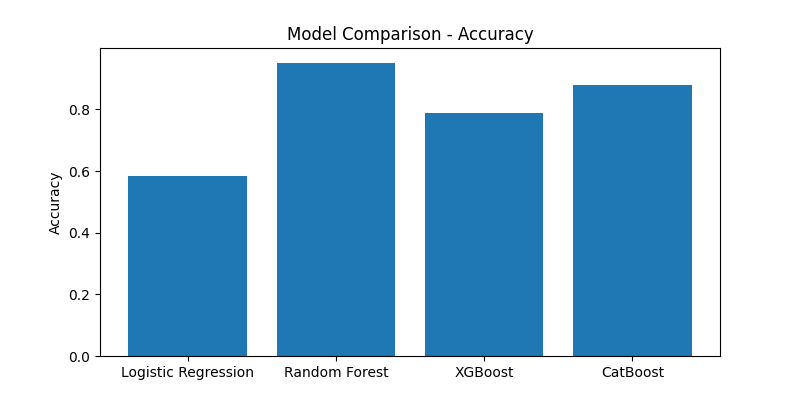
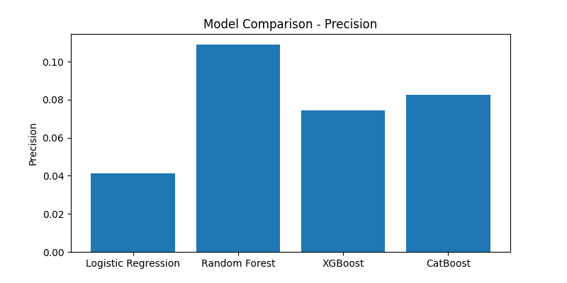
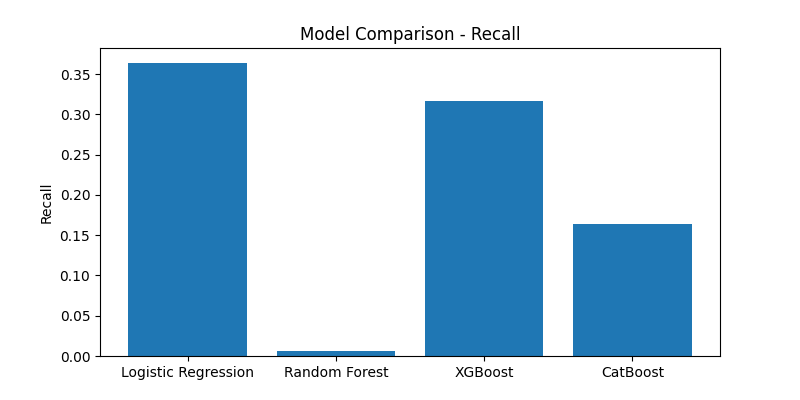
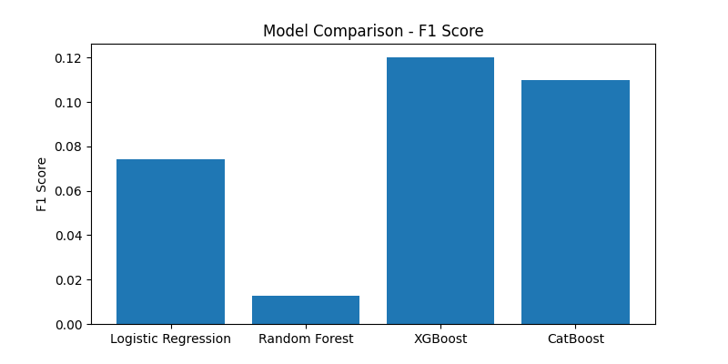
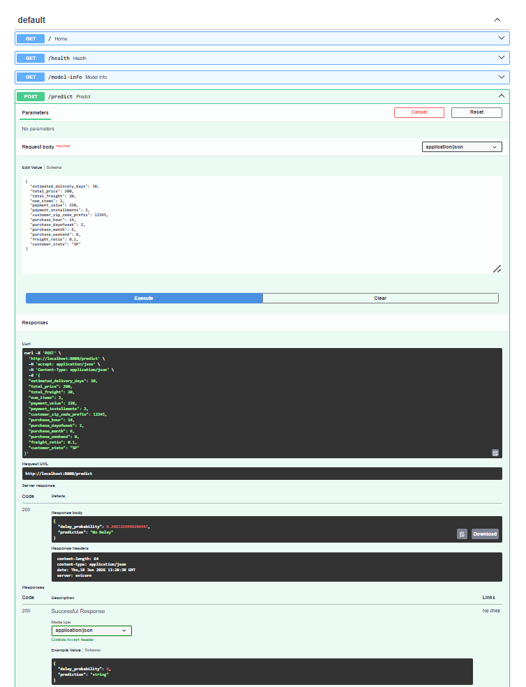
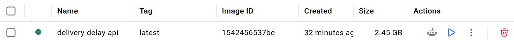

# Delivery Delay Predictor

## Overview

Delivery Delay Predictor is a machine learning project that predicts whether an e-commerce order will be delivered late using historical order, payment, freight, and customer information from the Olist dataset.

The project combines:

* Feature Engineering
* CatBoost & XGBoost Models
* FastAPI REST API
* Docker Containerization
* Model Evaluation and Comparison

The goal is to identify high-risk deliveries before delays occur and help logistics teams take preventive action.

## Business Problem

Late deliveries negatively impact customer satisfaction and operational efficiency. Predicting delays before shipment allows businesses to improve logistics planning, customer communication, and inventory management.

## Dataset

Source: Olist Brazilian E-commerce Dataset

The dataset contains information about:

* Orders
* Customers
* Payments
* Products
* Sellers
* Freight Costs
* Delivery Dates

Target Variable:

## Project Structure

delivery-delay-predictor/

├── api/                # FastAPI application

├── data/               # Raw and processed datasets

├── models/             # Saved trained models

├── notebooks/          # Exploratory analysis

├── results/            # Evaluation metrics and charts

├── src/                # Feature engineering and model training code

├── Dockerfile          # Docker configuration

├── requirements.txt    # Project dependencies

└── README.md

## Feature Engineering

The following features were created and used for model training:

* estimated_delivery_days
* total_price
* total_freight
* num_items
* payment_value
* payment_installments
* customer_zip_code_prefix
* purchase_hour
* purchase_dayofweek
* purchase_month
* purchase_weekend
* freight_ratio
* customer_state (one-hot encoded)

Additional time-based features were extracted from purchase timestamps to capture seasonal and behavioral patterns.

## Models Trained

The following models were evaluated:

1. Logistic Regression
2. Random Forest
3. XGBoost
4. CatBoost

Hyperparameter tuning and threshold optimization were performed to improve minority-class detection.

## Results

| Model               | Accuracy | Precision | Recall | F1 Score |
| ------------------- | -------- | --------- | ------ | -------- |
| Logistic Regression | 0.5836   | 0.0413    | 0.3643 | 0.0742   |
| Random Forest       | 0.9519   | 0.1091    | 0.0068 | 0.0128   |
| XGBoost             | 0.7039   | 0.0665    | 0.4186 | 0.1147   |
| CatBoost            | 0.8660   | 0.0825    | 0.1900 | 0.1150   |

CatBoost achieved the best overall balance between precision and recall after tuning and was selected for deployment through the FastAPI service.

### Model Comparison









## FastAPI Endpoints

### API Demonstration



### GET /

Returns a welcome message.

### GET /health

Checks API health status.

Response:

```json
{
  "status": "healthy"
}
```

### GET /model-info

Returns deployed model information.

Response:

```json
{
  "model_name": "CatBoost",
  "version": "1.0"
}
```

### POST /predict

Predicts delivery delay probability.

Example Request:

```json
{
  "estimated_delivery_days": 10,
  "total_price": 200,
  "total_freight": 20,
  "num_items": 2,
  "payment_value": 220,
  "payment_installments": 2,
  "customer_zip_code_prefix": 12345,
  "purchase_hour": 14,
  "purchase_dayofweek": 2,
  "purchase_month": 6,
  "purchase_weekend": 0,
  "freight_ratio": 0.1,
  "customer_state": "SP"
}
```

Example Response:

```json
{
  "delay_probability": 0.34,
  "prediction": "No Delay"
}
```
## Docker Usage

Build Image:

```bash
docker build -t delivery-delay-api .
```

Run Container:

```bash
docker run -p 8000:8000 delivery-delay-api
```

Swagger Documentation:

```text
http://localhost:8000/docs
```
### Docker Container Running



## How to Run Locally

1. Clone Repository

```bash
git clone https://github.com/omkar-1210/delivery-delay-predictor.git
```

2. Create Virtual Environment

```bash
python -m venv venv
```

3. Activate Environment

```bash
venv\Scripts\activate
```

4. Install Dependencies

```bash
pip install -r requirements.txt
```

5. Start API

```bash
uvicorn api.main:app --reload
```
## Future Improvements

* Improve minority-class prediction performance.
* Add automated feature pipeline during inference.
* Deploy API to a cloud platform.
* Add monitoring and logging.
* Implement CI/CD pipeline.
* Create interactive dashboard for predictions.

## Author

Omkar Lone

GitHub:
https://github.com/omkar-1210

---

Project built using Python, CatBoost, FastAPI, Docker, and the Olist E-commerce Dataset.


Target Variable:

- delay_flag = 1 → Order delivered late
- delay_flag = 0 → Order delivered on time
